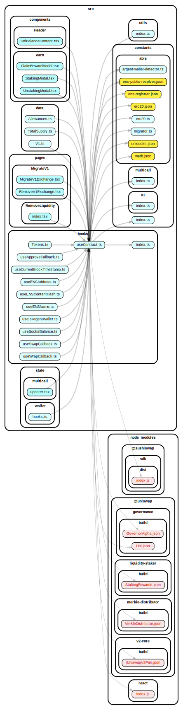
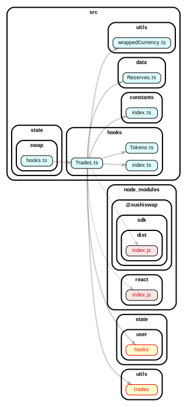
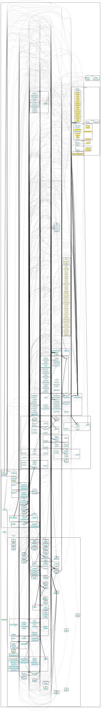

## Changed Settings


## Geneerate Dep Charts


```bash
dependency-cruise -T json src -f cruise_result.json
```

```bash
depcruise-fmt -T dot --focus src/hooks/useContract.ts cruise_result.json | dot -T svg > Contract.svg
```


## Dependency Resolution and Mapping









